#** 🏎️ Grand Theft Auto: Vice City - Android **

  
   
  <em>"Welcome to Vice City! The 1980s are back, and it's time to rule the streets."</em>

---

## 📱 About

**Grand Theft Auto: Vice City** - Now available for **all Android devices**! Experience the iconic open-world crime saga that defined a generation. Relive the neon-soaked 1980s with Tommy Vercetti in the most vibrant and dangerous city in gaming history.

---

## 📸 Screenshots

  
  | | | |
  |:---:|:---:|:---:|
  | 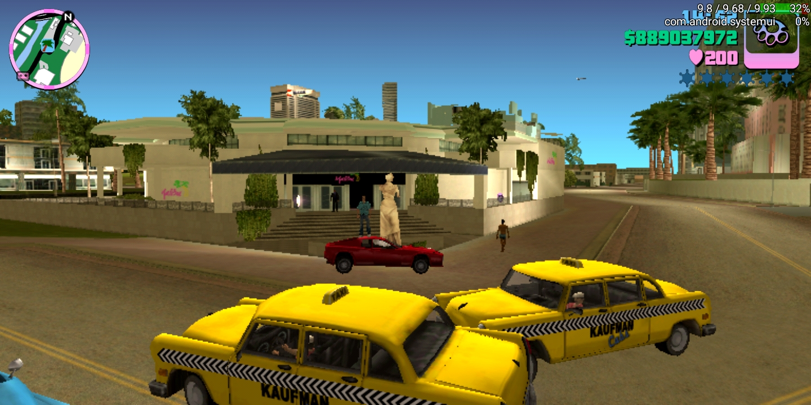 | 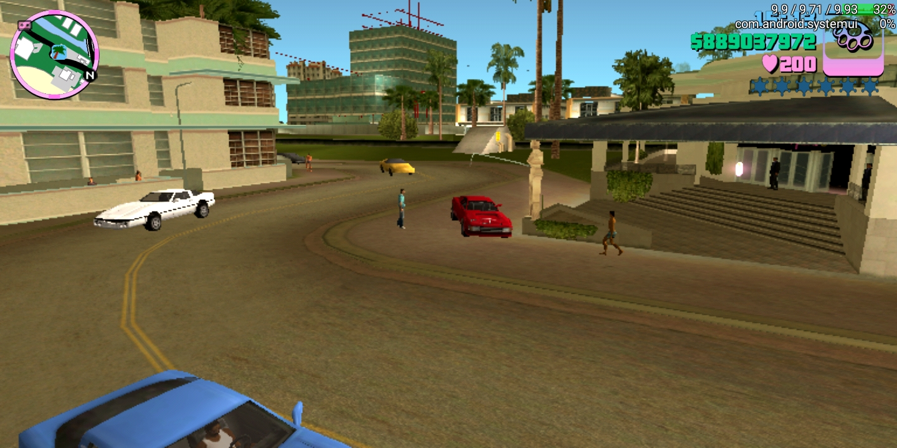 | 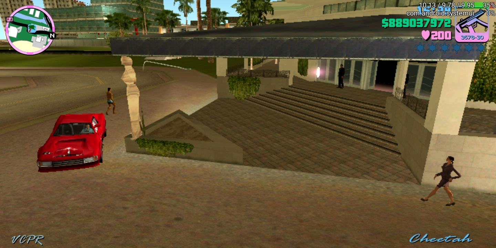 |
  | *Vice City Streets* | *Action Mode* | *Driving* |
  
  | | | |
  |:---:|:---:|:---:|
  | 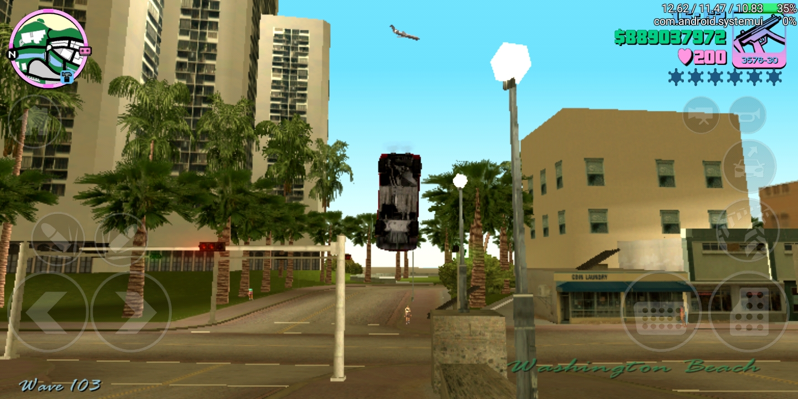 | 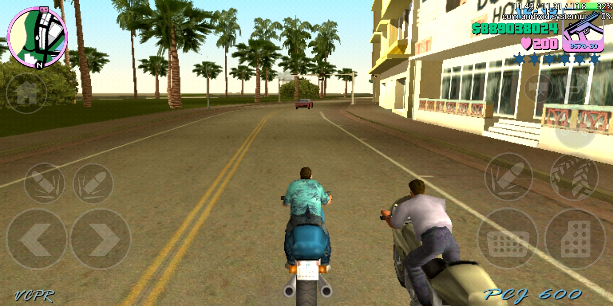 | 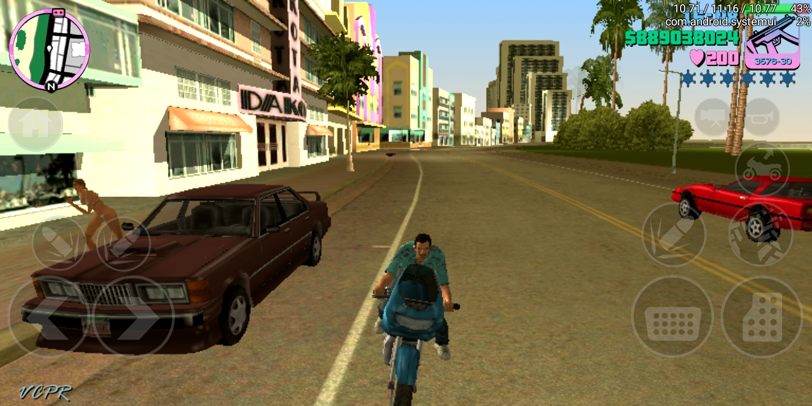 |
  | *Neon Nights* | *Miami Vibes* | *Tommy Vercetti* |
  
  | | | |
  |:---:|:---:|:---:|
  | 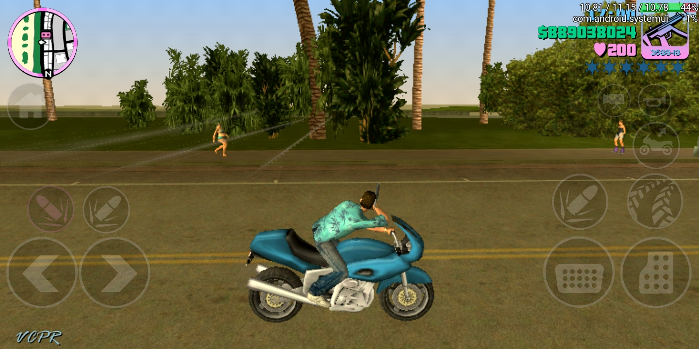 | 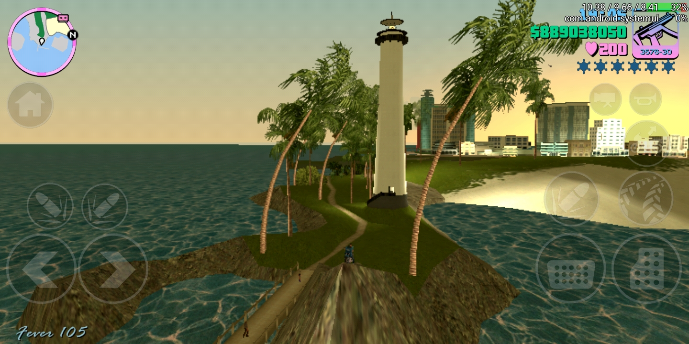 | 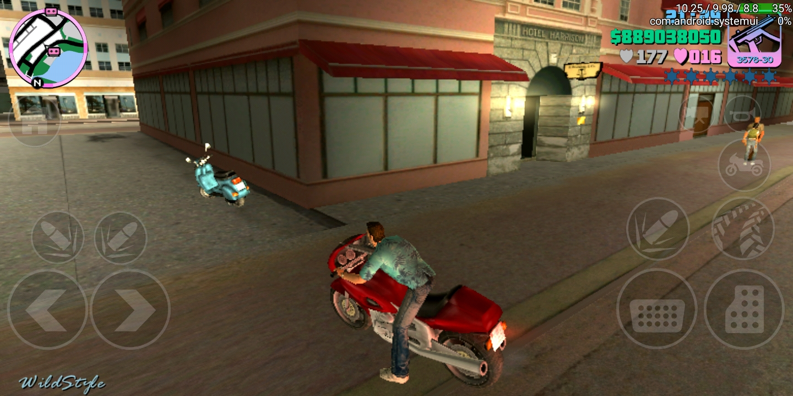 |
  | *Ocean Drive* | *Fast Cars* | *Police Chase* |
  
  | | | |
  |:---:|:---:|:---:|
  | 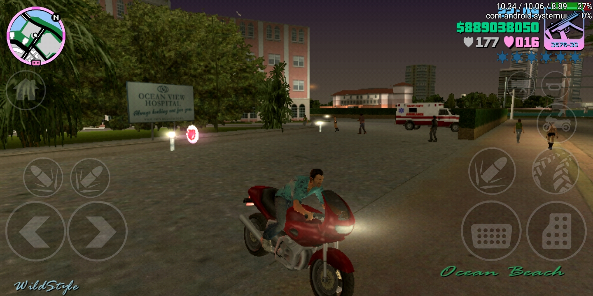 | 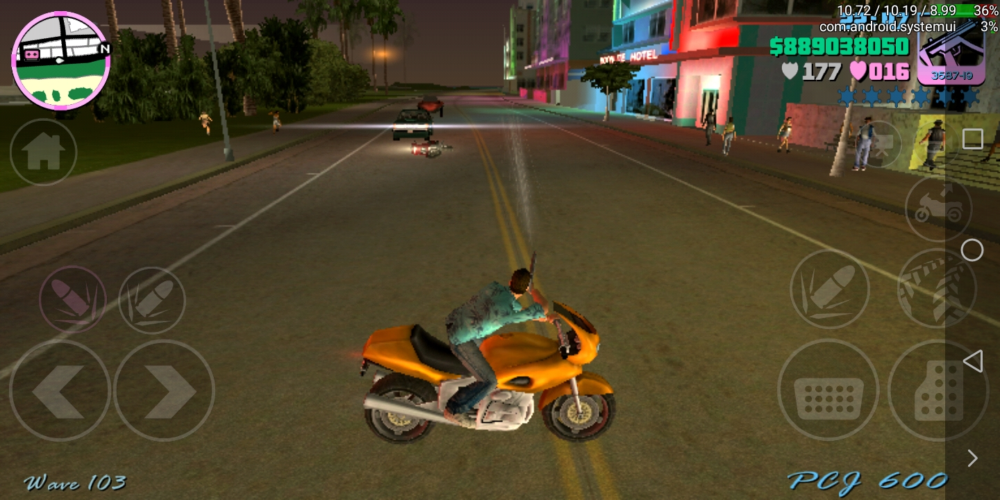 |  |
  | *Night Club* | *Helicopter* | *Game Banner* |

---

## 📥 Downloads

### 🔧 APK Files

| File | Size | Description |
|------|------|-------------|
| [📱 GTA_VC_1.12.apk](https://github.com/Uzair-Nawaz/GTA-VC/blob/main/GTA_VC_1.12.apk) | ~12 MB | Main GTA: Vice City APK |
| [🚀 Jojoy_3.2.26.apk](https://github.com/Uzair-Nawaz/GTA-VC/blob/main/Jojoy_3.2.26.apk) | ~28 MB | Jojoy Mod APK |

### 📦 OBB Data File

> ⚠️ **Important:** The OBB file is required to run the game!

| File | Size | Download |
|------|------|----------|
| `main.11.com.rockstargames.gtavc.obb` | 1.4 GB | [📥 Download from Google Drive](https://drive.google.com/file/d/1WWiHAOFBSspoGfZcNJAwV3tQOol_Ak0Z/view?usp=drivesdk) |

---

## 📂 Installation Guide

### Step-by-Step Instructions:

#### 1️⃣ Download the APK
- Choose either `GTA_VC_1.12.apk` or `Jojoy_3.2.26.apk` from above

#### 2️⃣ Download the OBB
- Download the OBB file (1.4 GB) from [Google Drive](https://drive.google.com/file/d/1WWiHAOFBSspoGfZcNJAwV3tQOol_Ak0Z/view?usp=drivesdk)

#### 3️⃣ Install the APK
- Open the APK file on your Android device
- **Enable "Install from Unknown Sources"** if prompted
- Complete the installation

#### 4️⃣ Place OBB File
- Copy the OBB file to:

- **Note:** Create the folder if it doesn't exist

#### 5️⃣ Launch & Play! 🎮
- Open the game from your app drawer
- Enjoy Vice City on your Android!

---

## 🎯 Features

| Feature | Description |
|---------|-------------|
| ✅ **Full Game** | Complete story mode + all side missions |
| ✅ **Optimized** | Smooth performance on most Android devices |
| ✅ **Touch Controls** | Customizable on-screen controls |
| ✅ **Mod Support** | Jojoy version with extra features |
| ✅ **Retro Vibes** | 80s neon, synthwave, and fast cars |
| ✅ **No Root Required** | Works on non-rooted devices |

---

## 📋 System Requirements

| Requirement | Minimum |
|-------------|---------|
| **Android Version** | 4.4+ (KitKat) |
| **RAM** | 2 GB |
| **Storage** | ~1.5 GB |
| **Processor** | 1.2 GHz+ |
| **Internet** | Required for first launch |

---

## 🎮 Gameplay Features

| Feature | Description |
|---------|-------------|
| 🏙️ **Open World** | Explore Vice City freely |
| 🚗 **Vehicles** | Cars, bikes, boats, and helicopters |
| 🔫 **Weapons** | Pistols, shotguns, rifles, and more |
| 📖 **Story Mode** | 80+ missions with Tommy Vercetti |
| 🎵 **Soundtrack** | 80s hits from multiple radio stations |
| 💰 **Side Activities** | Rampages, races, and collectibles |

---

## ⚠️ Important Notes

> **Before installing:**
> - Ensure you have **enough storage space** (1.5 GB free)
> - **Backup your data** before installation
> - **OBB file** must be placed in the correct folder for the game to work
> - For **Jojoy version**, you may need to allow additional permissions

---

## 🔗 Useful Links

- 📦 **[GitHub Repository](https://github.com/Uzair-Nawaz/GTA-VC)**
- 🗺️ **[Google Drive OBB Mirror](https://drive.google.com/file/d/1WWiHAOFBSspoGfZcNJAwV3tQOol_Ak0Z/view?usp=drivesdk)**
- 📱 **[All Releases](https://github.com/Uzair-Nawaz/GTA-VC/releases)**

---

## ⚠️ Disclaimer

> This repository is for **educational and archival purposes only**. 
> 
> **Grand Theft Auto: Vice City** and all related content are the property of **Rockstar Games**. 
> 
> If you enjoy the game, please support the official release. This is not affiliated with or endorsed by Rockstar Games.

---

## ⭐ Support the Project

If you find this useful:
- ⭐ **Star** this repository on GitHub
- 🔗 **Share** with other GTA fans
- 📝 **Report issues** in the Issues section

---

## 📜 License

This project is licensed under the **BSL-1.0 License** - see the [LICENSE](LICENSE) file for details.

---

## 🙏 Credits

- 🎮 **Rockstar Games** - Original creators of GTA: Vice City
- 🔧 **Community** - For mods and support
- 📦 **Uzair-Nawaz** - Package maintainer

---

  
  **Made with ❤️ by [Uzair-Nawaz](https://github.com/Uzair-Nawaz)**
  
  ---
  
  *"Welcome to Vice City. You're going to love it here."* 🏙️🔥
  

